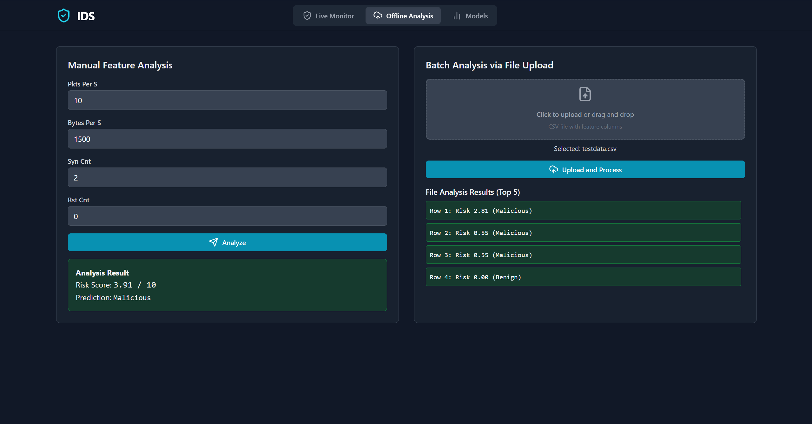
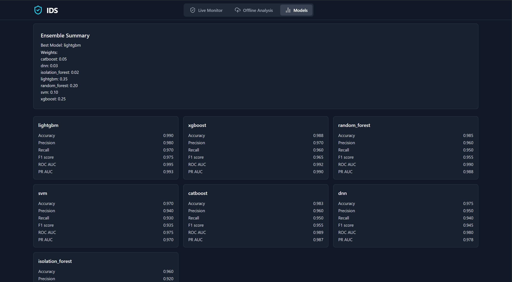

# Real-Time Intrusion Detection System (IDS)

A production‑grade, **real-time intrusion detection system** that automatically captures live network traffic, extracts streaming features, and predicts attack risk using a **multi-model ensemble**. The project is designed to be **portable**, **extensible**, and **easy to operate** across Windows, Linux, and macOS.
---

## UI Screenshots

> Put the images in an `images/` folder (or adjust the paths).

### Main Dashboard


### Offline Intrusion Detection 


### Models Comparison 


---

## ✨ Highlights

- **Online (live) mode**: automatic packet capture, 1‑second rolling features, ONNXRuntime inference, WebSocket streaming to a Wireshark‑style UI.
- **Offline mode**: score uploaded CSV/Parquet files that contain the 4 streaming features, or enter feature values manually.
- **Multi‑dataset training** (robustness by design): **CICIDS2018**, **CSE‑CIC‑IDS2018**, **UNSW‑NB15**, **CICIoT2023**, **NF‑ToN‑IoT**, **NSL‑KDD**.
- **Model suite**: LightGBM, XGBoost, CatBoost, Random Forest, SVM (RBF via Nystroem + LinearSVC), DNN/MLP (512→256→128 with BN+Dropout), Isolation Forest.
- **Ensemble fusion**: **PR‑AUC–weighted soft vote**; per‑model probabilities + final risk (0–10).
- **Artifacts**: ONNX models + `metrics.json` + `ensemble.json` + confusion matrix image.
- **Quality**: typed utilities, tests, pre‑commit hooks, CI workflow, docs, and reproducible outputs.

---

## 🧠 System Overview

```
             +------------------+
  Traffic →  | Capture Layer     |  PyShark (TShark) → Scapy fallback
             +---------+--------+
                       |
                       v
             +------------------+    1-second rolling window
             | Feature Engine    |  pkts_per_s, bytes_per_s, syn_cnt, rst_cnt
             +---------+--------+
                       |
                       v
             +------------------+
             | ONNX Ensemble    |  LGBM, XGB, RF, SVM, DNN, IF (+ CatBoost metrics)
             +---------+--------+
                       |
                       v
         WebSocket stream (JSON events)  →  Frontend (Live table + risk chart)
                       |
                       +--> REST (Offline scoring, metrics, health)
```

**Design goals**  
- Low‑latency inference on CPU (ONNXRuntime).  
- Resilient capture: thread‑safe PyShark; automatic fallback to Scapy.  
- Usable everywhere: sensible defaults, simple configuration, clear UI/UX.

---

## 📦 Feature Schema (Streaming‑Compatible)

| Feature        | Type  | Description                                                                 |
|----------------|-------|-----------------------------------------------------------------------------|
| `pkts_per_s`   | float | Packets observed during the current 1‑second window per second              |
| `bytes_per_s`  | float | Bytes observed during the current 1‑second window per second                |
| `syn_cnt`      | float | Count of TCP SYN flags in the current window                                |
| `rst_cnt`      | float | Count of TCP RST flags in the current window                                |
| `label`        | int   | 0 = benign, 1 = attack (training data only)                                 |
| `dataset`      | str   | Source dataset tag used during training                                     |

> Only flow‑level metadata is used; packet payloads are not stored or processed.

---

## 🧪 Datasets & Normalization

The training pipeline harmonizes six benchmarks into the common schema above. Normalization is **per dataset**, tolerant to missing columns and format differences:

- **CICIDS2018 / CSE‑CIC‑IDS2018**: flow duration, forward/backward packet and byte totals; SYN/RST flags.  
- **UNSW‑NB15**: source/destination bytes and derived rates; labeled via `label` or `attack_cat`.  
- **CICIoT2023 / NF‑ToN‑IoT**: IoT‑centric metadata mapped to streaming features.  
- **NSL‑KDD**: classic features reduced to counts/rates and TCP flag proxies for SYN/RST.

All frames are merged, invalid values replaced safely, and saved as a single training CSV.

---

## 🤖 Models & Ensemble

**Supervised**  
- Gradient‑Boosted Trees: LightGBM, XGBoost, CatBoost  
- Bagging: Random Forest  
- Kernel: SVM (StandardScaler → **Nystroem** RBF approximation → LinearSVC)

**Deep**  
- DNN/MLP: 512 → 256 → 128 with BatchNorm + Dropout (ONNX exported)

**Unsupervised**  
- Isolation Forest: anomaly score rescaled to probability‑like values

**Fusion**  
- **PR‑AUC–weighted soft vote** over available ONNX models.  
- Weights are written to `backend/models/artifacts/ensemble.json`.  
- CatBoost ONNX export can be unstable; its metrics still appear in `metrics.json`.

**Exported artifacts**  
- `lgbm.onnx`, `xgboost.onnx`, `rf.onnx`, `svm_rbf_approx.onnx`, `dnn_mlp.onnx`, `iso.onnx`  
- `metrics.json` (per‑model + ensemble)  
- `confusion_matrix.png` (best PR‑AUC model)  
- `ensemble.json` (weights)

---

## ⚙️ Runtime Behavior

- Capture runs continuously on the chosen network interface.  
- Windowing accumulates packets into a rolling 1‑second buffer and updates the four features.  
- Inference runs per window using ONNXRuntime for each available model and fuses the probabilities.  
- Output is a JSON event with the latest packet metadata, feature snapshot, per‑model probabilities, and final risk score.

**Event schema (WebSocket)**
```json
{
  "packet": { "time": 1739768433.172, "src": "10.0.0.5", "dst": "10.0.0.8", "proto": "TCP", "sport": 443, "dport": 59324, "len": 128 },
  "features": { "pkts_per_s": 102.0, "bytes_per_s": 93500.0, "syn_cnt": 3.0, "rst_cnt": 0.0 },
  "scores": {
    "risk": 6.8,
    "p_attack": 0.72,
    "per_model": { "lightgbm": 0.75, "xgboost": 0.73, "rf": 0.68, "svm_rbf": 0.70, "dnn_mlp": 0.74, "isoforest": 0.62 }
  }
}
```

---

## 🔌 API Overview

**Service base**: Backend exposes REST + WebSocket interfaces.

**Health & status**  
- `GET /` → Redirects to API docs  
- `GET /healthz` → Service health and capture status  
- `GET /online/status` → Current interface, BPF filter, last error, thread state

**Capture control**  
- `GET /online/list_ifaces` → Cross‑platform interface list  
- `GET /online/list_ifaces_verbose` → Detailed Windows Npcap listing  
- `POST /online/start` → Start capture; body accepts `iface` and `bpf`  
- `POST /online/stop` → Stop capture

**Streaming**  
- `GET /stream` (WebSocket) → JSON events as shown above

**Artifacts**  
- `GET /artifacts/metrics` → JSON with per‑model and ensemble metrics  
- `GET /artifacts/confusion` → PNG image of confusion matrix (best model)

**Offline scoring**  
- `POST /offline/manual` → JSON body `{ "feature_dict": { ... } }` → score result  
- `POST /offline/upload` → CSV/Parquet with the 4 features → batch results (response capped)

---

## 🖥️ Frontend (Wireshark‑Style UI)

- **Live IDS**: backend status badge, interface selector, start/stop controls, live risk chart, and recent packet table.  
- **Offline**: manual feature input + file upload; result cards with predicted risk.  
- **Models**: per‑model metrics, ensemble summary, and confusion matrix thumbnail.

The UI communicates with the backend via REST and a WebSocket stream.

---

## 🧰 Tooling & Quality

- Type checking: MyPy on critical utilities (`backend/utils/*`)  
- Lint/format: Ruff, Black, isort  
- Tests: PyTest for dataset normalizers, ensemble probability extraction, and offline scoring API  
- CI: GitHub Actions workflow for lint, type‑check, tests, and frontend build  
- Docs: Sphinx mini‑site with architecture notes  
- Containers: Docker for backend/frontend; compose file for multi‑service orchestration  
  *(Live packet capture inside containers can be restricted on some platforms.)*  
- Makefile: convenience targets for environment setup, training pipeline, checks, docs generation

---

## 🔐 Security & Privacy

- **Data minimization**: only flow metadata is processed; **no packet payloads** are stored.  
- **Principle of least privilege**: packet capture typically requires elevated privileges; operate with only the necessary permissions.  
- **CORS & rate‑limits**: defensive defaults on upload/manual endpoints; production deployments should restrict origins and add authentication where applicable.  
- **Logging**: structured logs; sensitive fields excluded; configurable verbosity.

---

## 📈 Performance & Targets

- **Latency**: sub‑50 ms per event on CPU for the 4‑feature window.  
- **Throughput**: designed for sustained, per‑second rolling windows on commodity hardware.  
- **Accuracy goals** (blended hold‑out; stratified): **Accuracy/F1 ≥ 95%**, **PR‑AUC ≥ 0.97**.  
  Results and confusion matrices are written into the artifacts folder for reproducibility.

---


## ⚙️ Configuration (Selected)

- **Capture**: `IDS_IFACE` (preferred interface), `IDS_BPF` (pcap filter)  
- **Server**: `BACKEND_HOST`, `BACKEND_PORT`  
- **Frontend**: `VITE_BACKEND_URL`  
- **Models**: `backend/models/artifacts/` for ONNX models and metadata (`metrics.json`, `ensemble.json`, images)

Defaults are chosen to work well out‑of‑the‑box; all values can be overridden through environment variables or configuration files.

---

## ⚠️ Limitations

- Packet capture requires appropriate privileges and a compatible pcap provider (Npcap/libpcap/TShark).  
- ONNX export for CatBoost may be unstable; metrics are included even when the ONNX file is omitted.  
- Running capture inside containers can be limited depending on platform and networking mode.

---

## 🗺️ Roadmap

- Extended feature set (duration, burstiness, port entropy, inter‑arrival stats).  
- Meta‑learner for ensemble fusion (e.g., logistic blender).  
- Optional Suricata/Zeek sidecar and rule/ML fusion features.  
- Drift monitoring and scheduled retraining hooks.  
- Role‑based access control and audit logging for production.

---

## 🙏 Acknowledgements

Thanks to the maintainers of the referenced datasets and the open‑source communities behind FastAPI, ONNX, scikit‑learn, LightGBM, XGBoost, CatBoost, PyTorch, PyShark, Scapy, and the React/Tailwind ecosystem.
